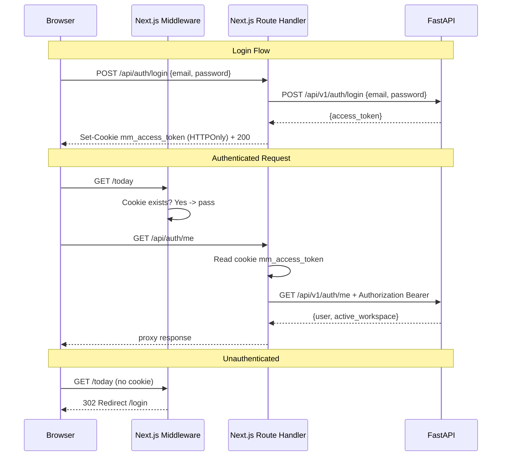

# Slice 0 Web — Plan d'implementation

## Architecture overview




## File structure

```
apps/web/
├── .env.local
├── next.config.ts
├── package.json
├── tsconfig.json
├── tailwind.config.ts
├── components.json               # shadcn config
├── src/
│   ├── middleware.ts              # Auth redirect
│   ├── app/
│   │   ├── layout.tsx            # Root: fonts, QueryProvider, I18nProvider
│   │   ├── (auth)/
│   │   │   └── login/
│   │   │       └── page.tsx      # Login form
│   │   ├── (dashboard)/
│   │   │   ├── layout.tsx        # Cockpit 3-column layout
│   │   │   ├── today/page.tsx
│   │   │   ├── inbox/page.tsx
│   │   │   ├── timeline/page.tsx
│   │   │   └── me/page.tsx
│   │   └── api/
│   │       └── auth/
│   │           ├── login/route.ts    # BFF: call FastAPI, set cookie
│   │           ├── logout/route.ts   # BFF: clear cookie
│   │           └── me/route.ts       # BFF: proxy with Bearer
│   ├── components/
│   │   ├── ui/                   # shadcn primitives (auto-generated)
│   │   ├── sidebar.tsx           # Nav sidebar
│   │   ├── providers.tsx         # Client providers wrapper
│   │   └── login-form.tsx        # Login form (client component)
│   ├── lib/
│   │   ├── bff.ts                # Server-side proxy helper
│   │   ├── constants.ts          # API_URL, cookie name
│   │   ├── query-client.ts       # TanStack Query setup
│   │   └── store.ts              # Zustand (minimal)
│   ├── hooks/
│   │   └── use-me.ts             # TanStack Query hook for /api/auth/me
│   ├── i18n/
│   │   ├── config.ts             # i18next init
│   │   ├── en.json               # English strings
│   │   └── fr.json               # French strings
│   └── schemas/
│       └── auth.ts               # Zod: loginSchema
```

## Decisions locked for this implementation

- **Port**: Next.js dev server on `localhost:3000` (CORS already configured in FastAPI)
- **Cookie name**: `mm_access_token`
- **Cookie attributes**: `httpOnly: true`, `sameSite: "lax"`, `path: "/"`, `secure: process.env.NODE_ENV === "production"`
- **FastAPI base URL**: `http://localhost:8000` (from `.env.local` as `API_URL`)
- **Default redirect after login**: `/today`
- **Middleware protected paths**: everything except `/login`, `/api/`*, `/_next/`*, static files
- **i18n default locale**: `fr`, supported: `fr`, `en`

## Approach: Blocks-first (shadcn/ui)

Instead of building UI from scratch, we leverage **shadcn/ui blocks** — pre-built, production-quality components that we adapt to our needs:

- `**login-03`** block: card centered on muted background, with social auth buttons (Google/Apple/GitHub) as disabled placeholders for future OAuth via `UserIdentity`
- `**sidebar-07`** block (collapsible to icons, style Notion/Linear): includes `TeamSwitcher` (= workspace switcher), `NavMain` (= nav links), `NavUser` (= avatar + logout dropdown), collapses to icon-only rail
- `**SidebarInset`**: main content area that replaces our custom 3-column layout

This gives us Notion/Linear-grade UI quality on day 1.

## Step-by-step implementation

### 1. Scaffold Next.js + shadcn/ui + blocks

Run from `apps/`:

```bash
npx create-next-app@latest web --typescript --tailwind --eslint --app --src-dir --import-alias "@/*" --no-turbopack
```

Then inside `apps/web/`:

```bash
npx shadcn@latest init
npx shadcn@latest add sidebar button input label card avatar separator dropdown-menu
```

The `sidebar` component installs the full sidebar system: `SidebarProvider`, `Sidebar`, `SidebarContent`, `SidebarHeader`, `SidebarFooter`, `SidebarMenu*`, `SidebarInset`, `SidebarTrigger`, `SidebarRail`.

### 2. Install dependencies

Inside `apps/web/`:

```bash
npm install @tanstack/react-query zustand zod i18next react-i18next
```

### 3. Environment: `.env.local`

```env
API_URL=http://localhost:8000
```

This is server-only (no `NEXT_PUBLIC_` prefix) — only BFF Route Handlers read it.

### 4. Constants: `src/lib/constants.ts`

```typescript
export const API_URL = process.env.API_URL ?? "http://localhost:8000";
export const COOKIE_NAME = "mm_access_token";
```

### 5. BFF proxy helper: `src/lib/bff.ts`

Server-side utility used by all Route Handlers:

- Reads `mm_access_token` from `cookies()`
- Forwards to `API_URL/api/v1/...` with `Authorization: Bearer`
- Returns `NextResponse` with FastAPI's status + body

### 6. BFF Route Handlers

`**src/app/api/auth/login/route.ts**` (POST):

1. Parse body `{email, password}`
2. `fetch(API_URL + "/api/v1/auth/login", { method: "POST", body })`
3. If FastAPI returns 200: extract `access_token`, set HTTPOnly cookie, return `{ ok: true }`
4. If error: forward status + message

`**src/app/api/auth/logout/route.ts**` (POST):

1. Delete cookie `mm_access_token`
2. Return 204

`**src/app/api/auth/me/route.ts**` (GET):

1. Use `bff.ts` helper to proxy to `/api/v1/auth/me`
2. Forward response

### 7. Auth middleware: `src/middleware.ts`

- Matcher: exclude `/login`, `/api/:path*`, `/_next/:path*`, favicon, static assets
- Logic: if no `mm_access_token` cookie -> redirect to `/login`
- On `/login` with valid cookie -> redirect to `/today`

### 8. i18next setup: `src/i18n/`

- `config.ts`: init i18next with `react-i18next`, `lng: "fr"`, resources from JSON files
- `en.json` / `fr.json`: minimal keys for Slice 0:
  - `nav.today`, `nav.inbox`, `nav.timeline`, `nav.me`
  - `auth.login`, `auth.email`, `auth.password`, `auth.submit`, `auth.logout`
  - `common.appName`
  - `pages.today.title`, `pages.inbox.title`, `pages.timeline.title`, `pages.me.title`
  - `workspace.switcher`

### 9. Providers: `src/components/providers.tsx`

Client component wrapping:

- `QueryClientProvider` (TanStack Query)
- i18next init (called once)
- Children pass-through

### 10. Root layout: `src/app/layout.tsx`

- `<html lang="fr">`
- Import fonts (Inter from next/font)
- Wrap children with `<Providers>`

### 11. Login page (based on shadcn `login-03` block)

`src/app/(auth)/login/page.tsx` + `src/components/login-form.tsx`

- `page.tsx`: server component, `<div className="bg-muted flex min-h-svh ...">` + logo + `<LoginForm />`
- `login-form.tsx`: client component adapted from login-03 block
  - shadcn `Card` with `CardHeader` / `CardContent` / `CardFooter`
  - **Social auth section** (top): 3 buttons "Continue with Google / Apple / GitHub" — visually present but `disabled` with `cursor-not-allowed`. Tooltip/title: "Coming soon". Prepares UI for future `UserIdentity` OAuth providers.
  - **Divider**: "Or continue with" separator
  - **Email + Password** form: shadcn `Input` + `Label` + `Button`
  - Zod validation via `src/schemas/auth.ts`
  - `onSubmit` -> `fetch("/api/auth/login")` -> on success `router.push("/today")`
  - Error display (invalid credentials) via shadcn Alert or inline message
  - All strings via i18n keys

### 12. Cockpit layout (based on shadcn `sidebar-07` collapsible to icons)

`src/app/(dashboard)/layout.tsx` uses `SidebarProvider` + `AppSidebar` + `SidebarInset`

```
+----+------------------------------------------+
| IC | SidebarInset (main content)              |    <- collapsed (icons only)
+----+------------------------------------------+

+-------------------+---------------------------+
| Sidebar (expanded)| SidebarInset              |    <- expanded (full labels)
| w-64, with labels | header + {children}       |
+-------------------+---------------------------+
```

The sidebar-07 variant uses `collapsible="icon"` — when collapsed, it shrinks to a narrow icon rail (like Notion/Linear sidebar). The user toggles between expanded/collapsed via `SidebarTrigger`.

`**src/components/app-sidebar.tsx**` (adapted from sidebar-07 patterns):

- **SidebarHeader**: `WorkspaceSwitcher` component
  - Based on shadcn `TeamSwitcher` pattern
  - Shows current workspace name + icon (full mode) / icon only (collapsed mode)
  - Dropdown with list of workspaces (Phase 1: single workspace, from `/api/auth/me`)
  - "Add workspace" option at bottom (disabled placeholder)
- **SidebarContent**: `NavMain` component
  - 4 nav items: Today (Sun icon), Inbox (Inbox icon), Timeline (Calendar icon), Me (User icon)
  - Active state via `usePathname()` matching
  - Lucide icons — visible in both expanded and collapsed modes
  - Labels hidden when collapsed (handled automatically by `SidebarMenuButton`)
- **SidebarFooter**: `NavUser` component
  - Based on shadcn `NavUser` pattern
  - Shows user avatar (initials from email) + email (expanded) / avatar only (collapsed)
  - Dropdown with "Logout" action -> `fetch("/api/auth/logout")` + `router.push("/login")`

`**src/app/(dashboard)/layout.tsx`**:

- `SidebarProvider` wraps everything
- `AppSidebar collapsible="icon"` (collapses to icon rail)
- `SidebarInset` contains a header (with `SidebarTrigger` + breadcrumb) + `{children}`

### 13. Empty pages

Each page under `(dashboard)/`:

- Client component (needs i18n `useTranslation()`)
- Renders a centered title (i18n key) + subtle icon
- Example: `pages.today.title` -> "Today" / "Aujourd'hui"
- Placeholder message: "This section is coming in Slice 1/2" (i18n)

### 14. Zod schemas: `src/schemas/auth.ts`

```typescript
import { z } from "zod";
export const loginSchema = z.object({
  email: z.string().min(1),
  password: z.string().min(1),
});
```

### 15. TanStack Query hook: `src/hooks/use-me.ts`

```typescript
export function useMe() {
  return useQuery({
    queryKey: ["me"],
    queryFn: () => fetch("/api/auth/me").then(r => r.json()),
  });
}
```

### 16. Zustand store: `src/lib/store.ts`

Minimal store (ready for future use):

```typescript
import { create } from "zustand";
interface AppState { sidebarOpen: boolean; toggleSidebar: () => void }
```

## Validation checklist (DoD Slice 0 Web)

- `POST /api/auth/login` sets HTTPOnly cookie; session survives refresh
- `GET /api/auth/me` works through BFF (cookie -> bearer -> FastAPI)
- Cockpit 3-column layout renders without error on authenticated routes
- Unauthenticated access to `/today` redirects to `/login`
- Logout clears cookie and redirects to `/login`
- All visible strings come from i18n dictionaries (no hardcoded text)

## Prerequisites before running

- Docker running with Postgres (`docker compose up -d db` from repo root)
- FastAPI running (`uv run uvicorn src.main:app --reload` from `apps/api/`)
- Seed data applied (`uv run python -m src.seed` from `apps/api/`)

