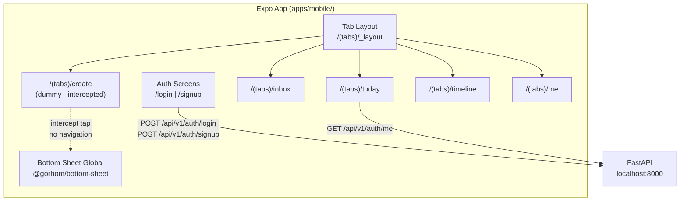

# Slice 0 Mobile + Spec Auto-Mode Ready (Phase 1 complete)

## Decisions verrouillees (toutes slices)

Ces decisions sont definitivement prises et doivent etre integrees dans la spec :

- **Expo Go** pour la Phase 1 (Custom Dev Client en Phase 2 pour Share Extension)
- **npm** comme package manager pour web et mobile
- **Connexion API mobile** : `EXPO_PUBLIC_API_URL` configurable (IP locale ou ngrok)
- **get_current_workspace** dans `deps.py` des la Slice 1 (filtrage workspace_id sur toutes les queries)
- **Pas de seed automatique** : donnees de test creees via UI/API
- **Slice 1 Today** : digest wireframe (3 priorities + next event + next action + inbox teaser)
- **Slice 1 Timeline** : `react-native-calendars` (Wix) + Adapter Pattern (`lib/adapters/calendarAdapter.ts`)
- **Slice 2 Editeur** : BlockNote.js (web, MIT) + TenTap Editor `@10play/tentap-editor` (mobile, MIT) — les deux bases sur ProseMirror, format JSON blocks compatible
- **Slice 2 notes.md** : BlockNote.js remplace la mention "BlockNote.js ou Tiptap"

---

## 1. Mise a jour de la spec Slice 0 (SDD Tracking)

Fichier : `[project/specs/Specifications Techniques Phase 1.md](project/specs/Spécifications Techniques Phase 1.md)`

Corrections a apporter :

- **Section 2.4** (ligne 65) : changer `Custom Dev Client : obligatoire (Expo Go interdit)` en `Expo Go pour la Phase 1 ; Custom Dev Client prevu pour la Phase 2 (Share Extension native)`
- **Slice 0 DoD** : cocher les items backend/web deja implementes et ajouter les items signup :
  - `[x] DB : PostgreSQL tourne ; migrations Alembic appliquees`
  - `[x] API : GET /api/v1/health repond 200`
  - `[x] API : POST /api/v1/auth/login retourne { access_token }`
  - `[x] API : GET /api/v1/auth/me retourne { user, active_workspace }`
  - `[x] API : POST /api/v1/auth/signup cree un user + workspace + retourne { access_token }`
  - `[x] Web : POST /api/auth/login pose un cookie HTTPOnly`
  - `[x] Web : POST /api/auth/signup fonctionne via BFF`
  - `[x] Web : GET /api/auth/me fonctionne via BFF`
  - `[x] Web : layout Cockpit 3 colonnes s'affiche`
  - `[ ] Mobile : les 5 onglets s'affichent` (a faire)
  - `[ ] Mobile : le bouton [+] ouvre un Bottom Sheet global` (a faire)
- **Slice 0 Out of scope** : retirer "Inscription (signup) publique" puisqu'elle est implementee
- **Slice 0 API Contract** : ajouter `POST /auth/signup` et `POST /api/auth/signup` (BFF)

## 2. Enrichir les Slices 1-4 (auto-mode ready)

Chaque slice doit etre enrichie avec un **Guide d'implementation** contenant :

- **Decisions verrouillees** specifiques a la slice
- **Fichiers a creer/modifier** : chemins exacts + description du contenu
- **Dependances a installer** : commandes exactes (`npm install ...`, `uv add ...`)
- **Ordre des etapes** : numerotees, avec dependances entre etapes
- **Patterns de reference** : "suivre le meme pattern que `apps/api/src/api/v1/auth.py`"
- **Snippets cles** : code minimal pour les patterns non-triviaux
- **Checklist de validation** : etapes concretes pour tester

### Slice 1 — enrichissements specifiques

- Ajouter decision : `get_current_workspace` dans `src/core/deps.py` (dep FastAPI qui extrait le workspace actif du user courant)
- Ajouter decision : page Today = digest wireframe ASCII (priorities, next event, next action, inbox teaser) — reference : `project/inbox_raw/2026-02-16_chatgpt_conv-01.md` lignes 11738-11756
- Ajouter decision : Timeline mobile = `react-native-calendars` (Wix, `TimelineList` component) + `src/lib/adapters/calendarAdapter.ts` (Adapter Pattern, IDEA-0543/0601)
- Ajouter decision : Timeline web = liste chronologique simple (pas de grille calendrier complexe en Phase 1)
- Ajouter guide : creation des modeles `Item` et `Event`, schemas Pydantic, routes FastAPI, BFF proxies, hooks TanStack, pages web et mobile

### Slice 2 — enrichissements specifiques

- Ajouter decision : editeur web = BlockNote.js (`@blocknote/react`, MIT)
- Ajouter decision : editeur mobile = TenTap Editor (`@10play/tentap-editor`, MIT, base sur Tiptap/ProseMirror)
- Ajouter decision : format JSON `blocks` partage entre web et mobile (compatibilite ProseMirror)
- Mettre a jour `project/notes.md` : remplacer "BlockNote.js ou Tiptap" par "BlockNote.js (web) + TenTap Editor (mobile)"
- Ajouter guide : creation de `inbox_captures`, extension `items.blocks`, endpoints CRUD, BFF, composants UI

### Slice 3 — enrichissements specifiques

- Ajouter guide : deep link handler Expo (`lifeos://share?text=...`), endpoint capture externe, habit_logs, mood widget

### Slice 4 — enrichissements specifiques

- Ajouter guide : audit workspace_id (verification que toutes les queries filtrent), pgvector setup, RAG stub

## 3. Cursor Rules (detaillees avec patterns)

Creer 4 fichiers dans `.cursor/rules/` avec des **exemples de code concrets** :

- `**project.mdc`** : conventions globales, SDD, spec SSoT, structure monorepo, comment lire la spec, comment cocher les DoD
- `**backend.mdc`** : "comment ajouter un modele", "comment ajouter une route", "comment ajouter un schema", avec des exemples de code pointant vers les fichiers existants
- `**web.mdc`** : "comment ajouter une route BFF", "comment ajouter une page", "comment ajouter un hook TanStack", avec references aux fichiers existants
- `**mobile.mdc**` : "comment ajouter un ecran", "comment appeler l'API", "comment ajouter une traduction", avec references aux fichiers existants

Chaque rule doit contenir des patterns du type :

```
## Comment ajouter une route API (backend)

1. Creer le schema Pydantic dans `src/schemas/<resource>.py`
   -> Suivre le pattern de `src/schemas/auth.py`
2. Creer le routeur dans `src/api/v1/<resource>.py`
   -> Suivre le pattern de `src/api/v1/auth.py`
3. Enregistrer dans `src/main.py` :
   -> `app.include_router(<resource>.router, prefix="/api/v1")`
4. Si nouveau modele : creer `src/models/<resource>.py`
   -> Heriter de `BaseMixin` (voir `src/models/base.py`)
   -> Ajouter l'import dans `src/models/__init__.py`
5. Generer la migration : `uv run alembic revision --autogenerate -m "add_<resource>"`
```

## 4. Mise a jour READMEs

- **Root `[README.md](README.md)`** : ajouter section Web (port 3000, `npm run dev`), section Mobile (Expo Go, `npx expo start`), corriger `pnpm` en `npm`, ajouter structure `apps/web/` et `apps/mobile/`
- `**[apps/api/README.md](apps/api/README.md)**` : corriger `passlib/bcrypt` en `bcrypt` (direct), ajouter route signup dans le tableau des routes
- **Creer `apps/web/README.md`** : stack, setup, routes BFF, structure des fichiers, design tokens
- **Creer `apps/mobile/README.md`** : stack, setup Expo Go, connexion API (IP locale / ngrok), structure des fichiers

## 4. Slice 0 Mobile — Implementation

### Decisions verrouillees

- **Environnement de test** : Expo Go (iPhone physique)
- **Package manager** : npm
- **Port API** : meme FastAPI sur localhost:8000 (tunnel ngrok ou IP locale pour le device physique)
- **Theme** : identique au web (memes couleurs via design tokens NativeWind)
- **Auth flow** : complet (login + signup + placeholders Google/Apple/GitHub)
- **Stockage token** : `expo-secure-store`

### Architecture mobile




### Structure des fichiers

```
apps/mobile/
├── app.json                    # Config Expo
├── package.json
├── tsconfig.json
├── babel.config.js             # NativeWind
├── nativewind-env.d.ts
├── global.css                  # Design tokens (memes couleurs que le web)
├── app/
│   ├── _layout.tsx             # Root layout (providers, auth guard)
│   ├── login.tsx               # Page de connexion
│   ├── signup.tsx               # Page d'inscription
│   └── (tabs)/
│       ├── _layout.tsx         # Tab navigator (5 onglets)
│       ├── today.tsx
│       ├── inbox.tsx
│       ├── create.tsx          # Dummy tab (intercepte le tap)
│       ├── timeline.tsx
│       └── me.tsx
├── components/
│   ├── BottomSheetCreate.tsx   # Bottom Sheet global (@gorhom)
│   ├── LoginForm.tsx
│   ├── SignupForm.tsx
│   └── ui/                    # react-native-reusables components
├── lib/
│   ├── api.ts                  # Fetch wrapper (token depuis SecureStore)
│   ├── auth.ts                 # Login/signup/logout + SecureStore
│   ├── store.ts                # Zustand (auth state)
│   └── query-client.ts         # TanStack Query config
├── i18n/
│   ├── config.ts
│   ├── fr.json                 # Copie des cles web + cles mobile
│   └── en.json
└── schemas/
    └── auth.ts                 # Zod (memes schemas que le web)
```

### Auth flow mobile (difference avec le web)

- **Pas de BFF** : le mobile appelle FastAPI directement (`POST /api/v1/auth/login`)
- **Pas de cookie** : le token est stocke dans `expo-secure-store`
- **Auth guard** : dans `app/_layout.tsx`, verifie si un token valide existe dans SecureStore ; sinon redirige vers `/login`

### Tab [+] — Bottom Sheet pattern

Le tab "create" est un **tab factice** :

1. Dans `(tabs)/_layout.tsx`, on intercepte le `tabPress` event sur le tab "create"
2. `e.preventDefault()` empeche la navigation
3. On ouvre le Bottom Sheet via un state Zustand global (`useCreateSheet.open()`)
4. Le `BottomSheetCreate` component est rendu dans `app/_layout.tsx` (au-dessus des tabs, visible partout)

### Connexion au backend depuis un device physique

Pour tester avec Expo Go sur un iPhone physique, le mobile doit acceder a FastAPI. Options :

- **IP locale** : remplacer `localhost:8000` par l'IP du Mac sur le reseau local (ex: `192.168.1.42:8000`). Configurable via variable d'env dans `app.json` > `extra`
- **ngrok** : `ngrok http 8000` pour un tunnel HTTPS (utile si reseau complexe)

Variable d'env : `EXPO_PUBLIC_API_URL` dans `app.json` ou `.env`

### Design tokens (preparation pour les themes futurs)

Les couleurs sont definies dans `global.css` avec les memes variables CSS que le web :

```css
:root {
  --background: oklch(1 0 0);
  --foreground: oklch(0.145 0 0);
  --primary: oklch(0.205 0 0);
  /* ... identique a apps/web/src/app/globals.css */
}
.dark {
  --background: oklch(0.145 0 0);
  /* ... */
}
```

NativeWind permet d'utiliser ces variables directement dans les composants RN avec `className="bg-background text-foreground"`.

Pour changer de theme plus tard : modifier uniquement les fichiers `global.css` (web et mobile), tout le reste s'adapte automatiquement.

## 5. Validation (DoD Mobile Slice 0)

- `npx expo start` lance l'app sans erreur
- Les 5 onglets s'affichent (Today, Inbox, [+], Timeline, Me)
- Le tap sur [+] ouvre le Bottom Sheet, pas de navigation
- Login fonctionne (token stocke dans SecureStore)
- Signup fonctionne
- Apres login, `/auth/me` retourne les donnees user
- Deconnexion efface le token et redirige vers login
- Toutes les strings passent par i18n
- Dark mode fonctionne via NativeWind

