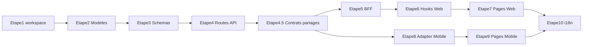

# Plan d'implémentation — Slice 1 (Today vs Timeline)

Référence : [project/specs/Spécifications Techniques Phase 1.md](project/specs/Spécifications Techniques Phase 1.md) (lignes 198-323).  
Conventions : [.cursor/rules/project.mdc](.cursor/rules/project.mdc), [backend.mdc](.cursor/rules/backend.mdc), [web.mdc](.cursor/rules/web.mdc), [mobile.mdc](.cursor/rules/mobile.mdc).

---

## Décision — Digest Today (option B)

- **next_event** : premier event du jour (par `start_at` ASC), pour la date du jour (UTC). Null si aucun event.
- **next_action** : premier item prioritaire (par `priority_order` ASC). Null si aucun item avec `priority_order` (ou on peut exposer `priorities[0]` comme next_action quand la liste est non vide).

---

## Pré-requis (avant de commencer)

- **Docker / Postgres** : vérifier que le conteneur tourne (`docker compose up -d` ou équivalent) et que l'API peut se connecter.
- **Migrations** : `cd apps/api && uv run alembic upgrade head` (révision actuelle : `ba758d0eff25`).
- **Code existant à réutiliser** :
  - Backend : [apps/api/src/core/deps.py](apps/api/src/core/deps.py) (`get_current_workspace` déjà présent), [apps/api/src/models/base.py](apps/api/src/models/base.py), [apps/api/src/models/user.py](apps/api/src/models/user.py), [apps/api/src/models/workspace.py](apps/api/src/models/workspace.py), [apps/api/src/schemas/auth.py](apps/api/src/schemas/auth.py), [apps/api/src/api/v1/auth.py](apps/api/src/api/v1/auth.py), [apps/api/src/main.py](apps/api/src/main.py).
  - Web : [apps/web/src/lib/bff.ts](apps/web/src/lib/bff.ts) (`proxyWithAuth`), [apps/web/src/app/api/auth/me/route.ts](apps/web/src/app/api/auth/me/route.ts), [apps/web/src/hooks/use-me.ts](apps/web/src/hooks/use-me.ts), [apps/web/src/app/(dashboard)/today/page.tsx](apps/web/src/app/(dashboard)/today/page.tsx), [apps/web/src/app/(dashboard)/timeline/page.tsx](apps/web/src/app/(dashboard)/timeline/page.tsx).
  - Mobile : [apps/mobile/lib/api.ts](apps/mobile/lib/api.ts), [apps/mobile/app/(tabs)/today.tsx](apps/mobile/app/(tabs)/today.tsx), [apps/mobile/app/(tabs)/timeline.tsx](apps/mobile/app/(tabs)/timeline.tsx).

---

## Étape 1 : Backend — Dépendance workspace

- **Action** : Vérifier que `get_current_workspace` dans [apps/api/src/core/deps.py](apps/api/src/core/deps.py) fonctionne (signature et comportement déjà conformes à la spec : retourne le `WorkspaceMember` le plus ancien, 404 si aucun).
- **Validation** : Aucun changement de code nécessaire ; on s'assure que les prochaines routes l'utiliseront pour filtrer par `workspace_id`.
- **DoD** : Aucun item à cocher directement ; prérequis pour les étapes suivantes.

---

## Étape 2 : Backend — Modèles Item + Event

- **Fichiers à créer** :
  - [apps/api/src/models/item.py](apps/api/src/models/item.py) : table `items` — `id`, `workspace_id` (FK → `workspaces.id`), `title` (Text), `priority_order` (Integer nullable), + BaseMixin (`created_at`, `updated_at`, `deleted_at`). Pattern : hériter `Base, BaseMixin` comme dans [apps/api/src/models/user.py](apps/api/src/models/user.py) et [apps/api/src/models/workspace.py](apps/api/src/models/workspace.py).
  - [apps/api/src/models/event.py](apps/api/src/models/event.py) : table `events` — `id`, `workspace_id` (FK), `item_id` (FK → `items.id`), `start_at`, `end_at` (DateTime(timezone=True)), `estimated_time_seconds` (Integer), `actual_time_acc_seconds` (Integer default 0), `is_tracking` (Boolean default False), `tracking_started_at` (DateTime nullable), + BaseMixin.
- **Modifier** : [apps/api/src/models/__init__.py](apps/api/src/models/__init__.py) — importer et exporter `Item`, `Event`.
- **Migration** : `cd apps/api && uv run alembic revision --autogenerate -m "add_items_events"` puis `uv run alembic upgrade head`.
- **DoD** : Cocher « **DB** : tables `items` (minimal) et `events` créées ; migrations appliquées ».

---

## Étape 3 : Backend — Schemas Pydantic

- **Fichiers à créer** :
  - [apps/api/src/schemas/today.py](apps/api/src/schemas/today.py) : `TodayResponse(priorities: list[PriorityItemOut], next_event: EventSummaryOut | None, next_action: PriorityItemOut | None)`. `PriorityItemOut` = item prioritaire (id, title, priority_order). `EventSummaryOut` = résumé event (id, item_id, title, start_at, end_at) pour next_event. next_action = premier item prioritaire (priorities[0] ou null).
  - [apps/api/src/schemas/timeline.py](apps/api/src/schemas/timeline.py) : `TimelineResponse(date: str, events: list[EventOut])`, `EventOut(id, item_id, title, start_at, end_at, estimated_time_seconds, actual_time_acc_seconds, is_tracking, tracking_started_at, …)` avec `model_config = {"from_attributes": True}`.
  - [apps/api/src/schemas/event.py](apps/api/src/schemas/event.py) : `StartTrackingResponse(event_id, is_tracking=True, tracking_started_at)`, `StopTrackingResponse(event_id, is_tracking=False, actual_time_acc: int)` (nombre de secondes).
- **Pattern** : [apps/api/src/schemas/auth.py](apps/api/src/schemas/auth.py) (BaseModel, uuid, from_attributes).
- **DoD** : Aucun item isolé ; nécessaire pour l'étape 4.

---

## Étape 4 : Backend — Routes API

- **Fichiers à créer** :
  - [apps/api/src/api/v1/today.py](apps/api/src/api/v1/today.py) : `GET /today` — `Depends(get_current_workspace)`. **priorities** : items avec `priority_order IS NOT NULL`, tri `priority_order ASC`, limite 3. **next_event** : premier event du jour (date = aujourd’hui UTC), tri `start_at ASC`, limit 1, joindre Item pour titre ; null si aucun. **next_action** : premier item prioritaire (même query que priorities, limit 1) ; null si aucun. Réponse : `TodayResponse`.
  - [apps/api/src/api/v1/timeline.py](apps/api/src/api/v1/timeline.py) : `GET /timeline?date=YYYY-MM-DD` — query events du workspace pour la journée (start_at/end_at dans la date), joindre Item pour le titre ; retourner `TimelineResponse(date=..., events=...)`.
  - [apps/api/src/api/v1/events.py](apps/api/src/api/v1/events.py) : `POST /events/{event_id}/start` → mettre `is_tracking=True`, `tracking_started_at=now()` ; `POST /events/{event_id}/stop` → mettre `is_tracking=False`, incrémenter `actual_time_acc_seconds` par la durée écoulée, `tracking_started_at=None`. Idempotence : start si déjà tracking = 200 inchangé ; stop si pas tracking = 200 avec état actuel. Filtrer par `workspace_id` et `event.deleted_at.is_(None)`.
- **Modifier** : [apps/api/src/main.py](apps/api/src/main.py) — `include_router(today.router, prefix="/api/v1")`, idem pour `timeline` et `events`.
- **DoD** : Cocher « **API** : GET /api/v1/today retourne un digest valide », « **API** : GET /api/v1/timeline retourne la liste des Events sur une journée », « **API** : start/stop tracking met à jour actual_time_acc de manière idempotente ».

---

## Étape 4.5 : Contrats partagés TS (Web + Mobile)

- **Objectif** : éviter la duplication de schémas/types entre Web et Mobile tout en gardant FastAPI inchangé.
- **Fichiers à créer** :
  - [packages/shared/package.json](packages/shared/package.json) : package interne `@momentarise/shared` (types + exports).
  - [packages/shared/tsconfig.json](packages/shared/tsconfig.json) : config TS minimale.
  - [packages/shared/src/auth.ts](packages/shared/src/auth.ts), [packages/shared/src/today.ts](packages/shared/src/today.ts), [packages/shared/src/timeline.ts](packages/shared/src/timeline.ts), [packages/shared/src/events.ts](packages/shared/src/events.ts), [packages/shared/src/index.ts](packages/shared/src/index.ts) : schémas Zod + types inférés.
- **Fichiers à modifier** :
  - racine : `package.json` workspaces (`apps/web`, `apps/mobile`, `packages/shared`).
  - Web : [apps/web/next.config.ts](apps/web/next.config.ts) (`transpilePackages: ["@momentarise/shared"]`), puis remplacer les imports locaux de schémas.
  - Mobile : [apps/mobile/metro.config.js](apps/mobile/metro.config.js) (résolution workspace pour package partagé), puis remplacer les imports locaux de schémas.
- **Migration douce** : supprimer/vider progressivement [apps/web/src/schemas/auth.ts](apps/web/src/schemas/auth.ts) et [apps/mobile/schemas/auth.ts](apps/mobile/schemas/auth.ts) après bascule des imports.
- **DoD** : web + mobile compilent en important les contrats depuis `@momentarise/shared`.

---

## Étape 5 : Web — BFF Routes

- **Fichiers à créer** :
  - [apps/web/src/app/api/today/route.ts](apps/web/src/app/api/today/route.ts) : `GET` → `proxyWithAuth("/api/v1/today")`.
  - [apps/web/src/app/api/timeline/route.ts](apps/web/src/app/api/timeline/route.ts) : `GET` → transmettre query `date` à l'URL (ex. `proxyWithAuth(\`/api/v1/timeline?date=${date}\`)`).
  - [apps/web/src/app/api/events/[id]/start/route.ts](apps/web/src/app/api/events/[id]/start/route.ts) : `POST` → `proxyWithAuth(\`/api/v1/events/${id}/start\`, { method: "POST" })`.
  - [apps/web/src/app/api/events/[id]/stop/route.ts](apps/web/src/app/api/events/[id]/stop/route.ts) : `POST` → idem pour `/stop`.
- **Pattern** : [apps/web/src/app/api/auth/me/route.ts](apps/web/src/app/api/auth/me/route.ts) et [apps/web/src/lib/bff.ts](apps/web/src/lib/bff.ts).
- **DoD** : Partie « **Web** : pages Today/Timeline … requêtes via /api/* (BFF) » (côté routes BFF).

---

## Étape 6 : Web — Hooks TanStack Query + Contrats partagés

- **Fichiers à créer** :
  - [apps/web/src/hooks/use-today.ts](apps/web/src/hooks/use-today.ts) : `useQuery({ queryKey: ["today"], queryFn: () => fetch("/api/today").then(r => r.ok ? r.json() : Promise.reject(...)) })`.
  - [apps/web/src/hooks/use-timeline.ts](apps/web/src/hooks/use-timeline.ts) : `useQuery({ queryKey: ["timeline", date], queryFn: () => fetch(\`/api/timeline?date=${date}\`)... })` avec paramètre `date`.
  - [apps/web/src/hooks/use-tracking.ts](apps/web/src/hooks/use-tracking.ts) : `useMutation` pour start (POST `/api/events/{id}/start`) et stop (POST `/api/events/{id}/stop`), avec `onSuccess` → `invalidateQueries(["today"], ["timeline", date])`.
- **Pattern** : [apps/web/src/hooks/use-me.ts](apps/web/src/hooks/use-me.ts).
- **Contrat** : parser/réutiliser les payloads via `@momentarise/shared` (pas de redéfinition locale des types Slice 1).
- **DoD** : Soutien aux pages (étape 7).

---

## Étape 7 : Web — Pages Today + Timeline

- **Modifier** [apps/web/src/app/(dashboard)/today/page.tsx](apps/web/src/app/(dashboard)/today/page.tsx) : utiliser `useToday()` ; afficher le digest : section Priorities (liste, max 3), Next event, Next action ; états vides (priorities vide, next_event/next_action null) avec textes i18n (déjà partiellement présents dans [apps/web/src/i18n/fr.json](apps/web/src/i18n/fr.json)).
- **Modifier** [apps/web/src/app/(dashboard)/timeline/page.tsx](apps/web/src/app/(dashboard)/timeline/page.tsx) : `useTimeline(date)` (date = aujourd'hui par défaut, format YYYY-MM-DD), liste chronologique des events (heure + titre + bouton Start/Stop), appeler `useTracking()` pour start/stop. État vide si `events.length === 0` avec i18n.
- **DoD** : Cocher « **Web** : pages Today/Timeline intégrées au cockpit ; requêtes via /api/* (BFF) ».

---

## Étape 8 : Mobile — Adapter Pattern

- **Créer** [apps/mobile/lib/adapters/calendarAdapter.ts](apps/mobile/lib/adapters/calendarAdapter.ts) : fonction `eventsToCalendarFormat(events: EventOut[])` qui convertit les events API au format attendu par `react-native-calendars` (ex. format TimelineList / agenda).
- **Installation** : dans `apps/mobile`, utiliser `npx expo install react-native-calendars` (pas `npm install` seul pour packages RN/Expo). Si des conflits npm : `npm install --legacy-peer-deps` pour les dépendances non-Expo.
- **DoD** : Prérequis pour l'étape 9 (Timeline mobile).

---

## Étape 9 : Mobile — Pages Today + Timeline

- **Créer** [apps/mobile/hooks/use-today.ts](apps/mobile/hooks/use-today.ts) et [apps/mobile/hooks/use-timeline.ts](apps/mobile/hooks/use-timeline.ts) : même logique que le web mais appel direct FastAPI via [apps/mobile/lib/api.ts](apps/mobile/lib/api.ts) (`apiFetch("/api/v1/today")`, `apiFetch(\`/api/v1/timeline?date=${date}\`)`). Utiliser TanStack Query.
- **Créer** (ou centraliser) hook/mutations pour start/stop (ex. `use-tracking.ts` ou dans le même fichier que timeline) — appel `apiFetch(\`/api/v1/events/${id}/start\`, { method: "POST" })`, etc.
- **Modifier** [apps/mobile/app/(tabs)/today.tsx](apps/mobile/app/(tabs)/today.tsx) : afficher le digest (priorities, next_event, next_action) avec états vides propres (i18n).
- **Modifier** [apps/mobile/app/(tabs)/timeline.tsx](apps/mobile/app/(tabs)/timeline.tsx) : utiliser `TimelineList` de `react-native-calendars` avec les données passées par `eventsToCalendarFormat(events)` ; vue jour uniquement. Boutons start/stop sur les events.
- **Contrat** : parser/réutiliser les payloads via `@momentarise/shared` (pas de redéfinition locale des types Slice 1).
- **Chrono fluide (DoD)** : lors du tracking, afficher un tick local (timer qui s'incrémente chaque seconde côté client) sans attendre le réseau ; synchroniser au stop. Éviter que l'UI dépende d'un polling serveur pour le chrono.
- **DoD** : Cocher « **Mobile** : Today tab + Timeline tab affichent des états vides propres (i18n) », « **Mobile** : le chrono UI reste fluide (tick local) même si le réseau est lent ».

---

## Wireframes ASCII — écrans mobiles (Slice 1)

### Today (onglet) — digest

Vue « digest » : 3 priorités max, prochain event, prochaine action. États vides gérés en i18n.

**Avec données :**

```
┌─────────────────────────────────────────┐
│ Today • Lun 23 Fév                       │
│ ─────────────────────────────────────── │
│ PRIORITÉS                               │
│ [1] React session (25 min)    [Démarrer]│
│ [2] Post LinkedIn (10 min)    [Ouvrir]  │
│ [3] Payer facture (5 min)     [Fait]    │
│ ─────────────────────────────────────── │
│ PROCHAIN ÉVÉNEMENT                      │
│ 14:00 Call • 13:30 partir (+10 buffer)   │
│ [Brief] [Notes]                          │
│ ─────────────────────────────────────── │
│ PROCHAINE ACTION                        │
│ « Ouvrir Leçon #3 et faire l'étape 1 »  │
│ [Focus 25:00]  [Passer]                 │
└─────────────────────────────────────────┘
```

**État vide (priorities = [], next_event = null, next_action = null) :**

```
┌─────────────────────────────────────────┐
│ Today • Lun 23 Fév                       │
│ ─────────────────────────────────────── │
│ PRIORITÉS                               │
│   Aucune priorité pour aujourd'hui.     │
│ ─────────────────────────────────────── │
│ PROCHAIN ÉVÉNEMENT                      │
│   Aucun événement prévu.                │
│ ─────────────────────────────────────── │
│ PROCHAINE ACTION                        │
│   Aucune action planifiée.              │
└─────────────────────────────────────────┘
```

(Textes via i18n : `pages.today.emptyPriorities`, `pages.today.emptyNextEvent`, `pages.today.emptyNextAction` ou équivalent.)

### Timeline (onglet) — vue jour

Vue jour uniquement : `TimelineList` (react-native-calendars) alimentée par l'adapter. Chaque event : heure, titre, bouton Démarrer / Arrêter. Chrono local (tick chaque seconde) pendant le tracking.

**Avec events :**

```
┌─────────────────────────────────────────┐
│ Timeline • 23 fév. 2026                  │
│ ─────────────────────────────────────── │
│ 09:00  React session          [Démarrer] │
│ 09:30  Post LinkedIn          [Démarrer] │
│ 10:00  Call client    ● 12:34 [Arrêter] │  ← en cours, chrono local
│ 11:00  Pause                             │
│ ─────────────────────────────────────── │
│ (heure)  (titre item)         (action)   │
└─────────────────────────────────────────┘
```

**État vide (events = []) :**

```
┌─────────────────────────────────────────┐
│ Timeline • 23 fév. 2026                  │
│ ─────────────────────────────────────── │
│                                        │
│   Aucun événement ce jour.             │
│                                        │
└─────────────────────────────────────────┘
```

(i18n : `pages.timeline.emptyDay` ou équivalent.)

### Comportement chrono (DoD)

Pendant le tracking : le temps écoulé (ex. 12:34) est mis à jour **localement** chaque seconde (ou toute la seconde), sans attendre le réseau. Au clic sur « Arrêter », envoi de `POST .../stop` puis mise à jour des données (today/timeline) après réponse.

---

## Étape 10 : i18n

- **Fichiers** : [apps/web/src/i18n/fr.json](apps/web/src/i18n/fr.json), [apps/web/src/i18n/en.json](apps/web/src/i18n/en.json), [apps/mobile/i18n/fr.json](apps/mobile/i18n/fr.json), [apps/mobile/i18n/en.json](apps/mobile/i18n/en.json).
- **Action** : Ajouter toutes les clés utilisées par les nouvelles vues (today digest : priorities, next_event, next_action, empty states ; timeline : empty state, start/stop, labels). Pas de chaîne en dur dans l'UI (convention projet).
- **DoD** : Déjà partiellement couvert par les états vides ; vérifier qu'aucune string en dur ne reste.

---

## Règles à respecter

- **Out of scope** (ne pas implémenter) : vue semaine, drag & drop, récurrence ; sync calendrier externe ; shifting automatique IA.
- **Contrats** : pour Slice 1, les types/schemas TS sont centralisés dans `packages/shared` ; ne pas dupliquer `today/timeline/events` dans `apps/web` et `apps/mobile`.
- **Après chaque étape** : cocher les `- [ ]` → `- [x]` dans la spec (section Slice 1 DoD) ; lancer le linter sur les fichiers modifiés.
- **Mobile** : `npx expo install <package>` pour les packages Expo/React Native ; `npm install --legacy-peer-deps` si besoin. Ne tuer que le port concerné (ex. 8081 pour Expo), jamais tous les ports.
- **Backend** : toutes les routes métier filtrent par `workspace_id` via `get_current_workspace` et excluent `deleted_at IS NOT NULL`.

---

## Ordre d'exécution et dépendances



Etape 1 → 2 → 3 → 4 → 4.5 doivent être faites dans l'ordre. Ensuite : 5 → 6 → 7 (web) et 8 → 9 (mobile) peuvent avancer en parallèle conceptuellement ; l'étape 10 (i18n) en dernier ou en continu avec 7/9.
