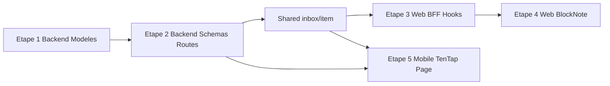

# Plan d'implémentation — Slice 2 (Inbox & Vue Détail)

## Contexte

- **Source de vérité** : [project/specs/Spécifications Techniques Phase 1.md](project/specs/Spécifications Techniques Phase 1.md) — section Slice 2.
- **Conventions** : [.cursor/rules/project.mdc](.cursor/rules/project.mdc), [backend.mdc](.cursor/rules/backend.mdc), [web.mdc](.cursor/rules/web.mdc), [mobile.mdc](.cursor/rules/mobile.mdc).
- **Hors scope** : IA (parsing/génération), attachments/fichiers/OCR, marketplace templates.

## Pré-requis (avant de coder)

1. **Docker / Postgres** : `docker compose up -d` (ou `docker-compose up -d`) et vérifier que le conteneur `db` tourne.
2. **Migrations** : `cd apps/api && uv run alembic upgrade head` — s’assurer qu’il n’y a pas de migrations en attente.
3. **Code existant à avoir lu** :
  - [apps/api/src/models/item.py](apps/api/src/models/item.py) — à étendre avec `blocks`.
  - [apps/api/src/models/**init**.py](apps/api/src/models/__init__.py) — y ajouter `InboxCapture`.
  - [apps/api/src/main.py](apps/api/src/main.py) — enregistrement des routeurs.
  - [apps/web/src/lib/bff.ts](apps/web/src/lib/bff.ts) — `proxyWithAuth` pour BFF (pour POST/PATCH avec body : passer `body: JSON.stringify(await request.json())` dans `init`).
  - [apps/web/src/app/(dashboard)/inbox/page.tsx](apps/web/src/app/(dashboard)/inbox/page.tsx) — page liste Inbox (captures + items récents) sans éditeur embarqué.
  - [apps/mobile/app/(tabs)/inbox.tsx](apps/mobile/app/(tabs)/inbox.tsx) — écran actuel à enrichir (liste + détail).
  - [apps/mobile/app/items/[id].tsx](apps/mobile/app/items/[id].tsx) — page cible pour le détail item plein écran.

---

## Étape 1 : Backend — Modèle InboxCapture + extension Item

**Fichiers à créer / modifier :**

- **Créer** `apps/api/src/models/inbox_capture.py` :
  - Hériter de `BaseMixin` et `Base`, `__tablename__ = "inbox_captures"`.
  - Colonnes : `workspace_id` (FK → workspaces), `user_id` (FK → users), `raw_content` (Text, non-null), `source` (Text, nullable, default `"manual"`).
  - Référence : [apps/api/src/models/event.py](apps/api/src/models/event.py) pour le style.
- **Modifier** [apps/api/src/models/item.py](apps/api/src/models/item.py) :
  - Ajouter `blocks` : `JSONB` avec `MutableList.as_mutable(JSONB)`, default `[]` (voir spec : SQLAlchemy `MutableList.as_mutable(JSONB)`).
  - Importer depuis `sqlalchemy.dialects.postgresql import JSONB` et utiliser un type mutable pour que les listes en place soient détectées par Alembic.
- **Modifier** [apps/api/src/models/**init**.py](apps/api/src/models/__init__.py) : importer et exporter `InboxCapture`.
- **Migration** :
  - `cd apps/api && uv run alembic revision --autogenerate -m "add_inbox_captures_and_item_blocks"`
  - Vérifier le script généré (table `inbox_captures`, colonne `items.blocks` avec default `[]`).
  - `uv run alembic upgrade head`

**DoD spec** : cocher « **DB** : table `inbox_captures` créée ; migration `items.blocks` ajoutée. »

---

## Étape 2 : Backend — Schemas + Routes Inbox / Items

**Schemas :**

- **Créer** `apps/api/src/schemas/inbox.py` :
  - `InboxCaptureOut(id, raw_content, created_at)`.
  - `CreateCaptureRequest(raw_content: str)`.
  - `ProcessCaptureResponse(item_id: uuid)`.
  - Référence : [apps/api/src/schemas/today.py](apps/api/src/schemas/today.py).
- **Créer** `apps/api/src/schemas/item.py` :
  - Modèle récursif pour les blocks (spec) : `ProseMirrorNode` avec `type: str`, `content: list["ProseMirrorNode"] | None`, `attrs: dict | None`, `text: str | None`, `marks: list[dict] | None` (Pydantic `BaseModel`).
  - `ItemOut(id, title, blocks)` avec `blocks` comme liste de `ProseMirrorNode` (ou dicts validés).
  - `UpdateItemRequest(blocks)` (au moins `blocks` pour PATCH).

**Routes :**

- **Créer** `apps/api/src/api/v1/inbox.py` :
  - `GET /inbox` → 200 `{ "captures": [ InboxCaptureOut ] }`, filtré par `workspace_id` et `deleted_at.is_(None)`.
  - `POST /inbox` → body `CreateCaptureRequest`, 201 `{ "id": uuid }`, enregistrer `user_id` depuis `get_current_user` + `workspace_id` depuis `get_current_workspace`.
  - `POST /inbox/{capture_id}/process` → body `{ "title": string }`, créer un `Item` avec ce `title` et `blocks=[]`, soft-delete la capture (`deleted_at = now()`), 200 `{ "item_id": uuid }`. Vérifier que la capture appartient au workspace.
- **Créer** `apps/api/src/api/v1/items.py` :
  - `GET /items` → 200 `ItemListResponse` trié `updated_at DESC`, filtré par `workspace_id` et `deleted_at.is_(None)`.
  - `GET /items/{item_id}` → 200 `ItemOut`, filtré par `workspace_id` et `deleted_at.is_(None)` (sinon 404).
  - `PATCH /items/{item_id}` → body `UpdateItemRequest`, mettre à jour `blocks` (et éventuellement `title` si dans le contrat), 200 `ItemOut`.
- Toutes les routes utilisent `Depends(get_current_workspace)` et, pour inbox create/process, `get_current_user` pour `user_id`.
- **Modifier** [apps/api/src/main.py](apps/api/src/main.py) : `app.include_router(inbox_router, prefix="/api/v1")` et `app.include_router(items_router, prefix="/api/v1")`.

**DoD spec** : cocher « **API** : création et listing Inbox », « **API** : transformation POST /inbox/{id}/process », « **API** : PATCH /items/{id} met à jour blocks ».

---

## Contrats partagés (package shared)

- **Créer** `packages/shared/src/inbox.ts` : schémas Zod + types pour `InboxCaptureOut`, `CreateCaptureRequest`, `ProcessCaptureResponse`, et réponse liste `{ captures: [...] }`.
- **Créer** `packages/shared/src/item.ts` : schémas Zod pour `ItemOut` (id, title, blocks), `UpdateItemRequest` (blocks). Pour `blocks`, structure minimale (type + content/attrs optionnels) ou `z.array(z.any())` pour Phase 1.
- **Modifier** [packages/shared/src/index.ts](packages/shared/src/index.ts) : `export * from "./inbox";` et `export * from "./item";`.

---

## Étape 3 : Web — BFF + Hooks

**BFF (Route Handlers) :**

- **Créer** `apps/web/src/app/api/inbox/route.ts` :
  - `GET` → `proxyWithAuth("/api/v1/inbox")`.
  - `POST` → `body = await request.json()`, `proxyWithAuth("/api/v1/inbox", { method: "POST", body: JSON.stringify(body) })`.
- **Créer** `apps/web/src/app/api/inbox/[id]/process/route.ts` :
  - `POST` avec `params.id`, body `{ title: string }` → proxy vers `POST /api/v1/inbox/{id}/process`.
- **Créer** `apps/web/src/app/api/items/[id]/route.ts` :
  - `GET` → proxy `GET /api/v1/items/{id}`.
  - `PATCH` → body `{ blocks }` (et optionnellement title) → proxy `PATCH /api/v1/items/{id}`.
- **Créer** `apps/web/src/app/api/items/route.ts` :
  - `GET` → proxy `GET /api/v1/items`.

**Hooks :**

- **Créer** `apps/web/src/hooks/use-inbox.ts` :
  - `useInbox()` : `useQuery({ queryKey: ["inbox"], queryFn: fetch /api/inbox })`, typage avec schéma shared.
  - `useCreateCapture()` : `useMutation` POST /api/inbox, `onSuccess` → `invalidateQueries(["inbox"])`.
  - `useProcessCapture()` : `useMutation` POST /api/inbox/{id}/process, invalider `["inbox"]` et `["items"]` (ou query key item si ouverte).
- **Créer** `apps/web/src/hooks/use-item.ts` :
  - `useItems()` : `useQuery` avec `queryKey: ["items"]`, `queryFn: GET /api/items`.
  - `useItem(id: string | null)` : `useQuery` quand `id` non null, `queryKey: ["item", id]`, `queryFn: GET /api/items/{id}`.
  - `useUpdateItem(id)` : `useMutation` PATCH /api/items/{id} avec **optimistic update** (TanStack Query : `onMutate` + rollback + `onSuccess` qui met à jour le cache, sans invalidate systématique).

Référence hooks : [apps/web/src/hooks/use-today.ts](apps/web/src/hooks/use-today.ts), [apps/web/src/hooks/use-timeline.ts](apps/web/src/hooks/use-timeline.ts).

**DoD spec** : partie « **Web** : Inbox liste captures + items récents ; détail Item sur `/inbox/items/[id]` ; mutations en optimistic UI » (complétée après étape 4).

---

## Étape 4 : Web — Éditeur BlockNote

- **Installer** : `cd apps/web && npm install @blocknote/core @blocknote/react @blocknote/mantine`.
- **Créer** `apps/web/src/components/block-editor.tsx` :
  - Wrapper BlockNote qui reçoit `value` (JSON blocks ProseMirror) et `onChange(blocks)`.
  - Utiliser l’API BlockNote pour initialiser le document à partir de `value` et écrire les changements en JSON (BlockNote peut exporter/importer un format compatible ProseMirror).
  - Documenter ou vérifier la compatibilité BlockNote ↔ ProseMirror JSON (spec : « format ProseMirror natif »).
- **Modifier** [apps/web/src/app/(dashboard)/inbox/page.tsx](apps/web/src/app/(dashboard)/inbox/page.tsx) :
  - Page `/inbox` : liste captures + items récents + état vide.
  - Afficher la liste des captures (GET /api/inbox), bouton « Ajouter » (POST capture), sur une capture « Process » → saisie du titre → POST process → redirection vers `/inbox/items/{id}`.
- **Créer** `apps/web/src/app/(dashboard)/inbox/items/[id]/page.tsx` :
  - Détail item plein écran (pas de `Card`), BlockNote occupant toute la zone de contenu.
  - Autosave débouncé (700 ms) + état `saving/saved/error`.
- **i18n** : ajouter les clés nécessaires dans [apps/web/src/i18n/fr.json](apps/web/src/i18n/fr.json) et [apps/web/src/i18n/en.json](apps/web/src/i18n/en.json) (inbox.add, inbox.process, item.details, item.blocks, etc.).

**DoD spec** : cocher « **Web** : Inbox liste captures + items récents ; détail Item sur `/inbox/items/[id]` ; mutations en optimistic UI via TanStack Query. »

---

## Étape 5 : Mobile — Éditeur TenTap + page détail plein écran

- **Installer** : `cd apps/mobile && npx expo install @10play/tentap-editor react-native-webview` (si erreurs de peer deps : `npm install --legacy-peer-deps` pour les paquets non-Expo).
- **Créer** `apps/mobile/app/items/[id].tsx` :
  - Page dédiée plein écran avec 3 onglets : **Détails**, **Blocs**, **Coach**.
  - Header avec retour Inbox + état `saving/saved/error`.
- **Créer** `apps/mobile/components/BlockEditor.tsx` :
  - Wrapper TenTap qui reçoit `value` (blocks JSON) et `onChange(blocks)`.
  - TenTap / Tiptap produit du JSON compatible ProseMirror ; synchroniser avec le state et l’API PATCH items/{id}.
- **Modifier** [apps/mobile/app/(tabs)/inbox.tsx](apps/mobile/app/(tabs)/inbox.tsx) :
  - Liste des captures (useInbox équivalent : appel direct FastAPI avec token depuis SecureStore).
  - Créer hooks `use-inbox.ts` et `use-item.ts` dans `apps/mobile/hooks/` (même logique que web mais fetch vers `EXPO_PUBLIC_API_URL` + Bearer).
  - Tap sur une capture → flow « Process » (saisie titre → POST process).
  - Tap sur un item (ou après process) → `router.push("/items/{id}")`.
- **i18n mobile** : [apps/mobile/i18n/fr.json](apps/mobile/i18n/fr.json) et [apps/mobile/i18n/en.json](apps/mobile/i18n/en.json) — clés pour inbox, item detail, onglets Détails/Blocs/Coach placeholder.

**DoD spec** : cocher « **Mobile** : Inbox tab liste + détail item en page plein écran (3 onglets : Détails, Blocs, Coach placeholder). »

---

## Ordre d’exécution et vérifications

- Après **chaque** étape : cocher les items DoD correspondants dans [project/specs/Spécifications Techniques Phase 1.md](project/specs/Spécifications Techniques Phase 1.md) (`- [ ]` → `- [x]`), puis lancer le linter / typecheck (web : `npm run lint`, mobile : `npx tsc --noEmit`).
- **Ne pas** implémenter ce qui est dans « Out of scope » Slice 2 (IA, attachments, marketplace).

---

## Points d’attention

- **Backend** : pour `items.blocks`, utiliser un type mutable (ex. `MutableList.as_mutable(JSONB)`) pour que les modifications in-place soient vues par la session SQLAlchemy.
- **BFF** : pour les routes POST/PATCH avec body, toujours faire `const body = await request.json(); return proxyWithAuth(..., { method: "POST", body: JSON.stringify(body) });`.
- **Mobile** : utiliser `npx expo install` pour `@10play/tentap-editor` et `react-native-webview` ; en cas d’échec npm, `npm install --legacy-peer-deps`.
- **Port** : ne tuer que le port du projet (ex. 3000 pour web, 8081 pour Expo) si besoin, jamais tous les processus Next/Expo.
