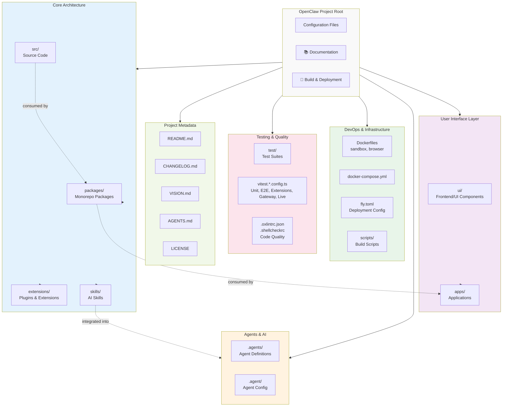

```mermaid
graph TB
    subgraph Root["OpenClaw Project Root"]
        Config["Configuration Files"]
        Docs["📚 Documentation"]
        BuildTools["🔨 Build & Deployment"]
    end
    
    subgraph Core["Core Architecture"]
        SRC["src/<br/>Source Code"]
        Packages["packages/<br/>Monorepo Packages"]
        Skills["skills/<br/>AI Skills"]
        Extensions["extensions/<br/>Plugins & Extensions"]
    end
    
    subgraph UI_Layer["User Interface Layer"]
        UI["ui/<br/>Frontend/UI Components"]
        Apps["apps/<br/>Applications"]
    end
    
    subgraph Agents_Layer["Agents & AI"]
        Agents[".agents/<br/>Agent Definitions"]
        Agent[".agent/<br/>Agent Config"]
    end
    
    subgraph DevOps["DevOps & Infrastructure"]
        Docker["Dockerfiles<br/>sandbox, browser"]
        DockerCompose["docker-compose.yml"]
        Fly["fly.toml<br/>Deployment Config"]
        Scripts["scripts/<br/>Build Scripts"]
    end
    
    subgraph Testing["Testing & Quality"]
        Tests["test/<br/>Test Suites"]
        VitestConfigs["vitest.*.config.ts<br/>Unit, E2E, Extensions, Gateway, Live"]
        Linting[".oxlintrc.json<br/>.shellcheckrc<br/>Code Quality"]
    end
    
    subgraph ProjectMeta["Project Metadata"]
        README["README.md"]
        CHANGELOG["CHANGELOG.md"]
        VISION["VISION.md"]
        AGENTS_DOC["AGENTS.md"]
        LICENSE["LICENSE"]
    end
    
    Root --> Core
    Root --> UI_Layer
    Root --> Agents_Layer
    Root --> DevOps
    Root --> Testing
    Root --> ProjectMeta
    
    Core --> Packages
    Core --> Skills
    Core --> Extensions
    
    UI_Layer --> Apps
    
    SRC -.->|consumed by| Packages
    Packages -.->|consumed by| Apps
    Skills -.->|integrated into| Agents_Layer
    
    style Root fill:#f9f9f9
    style Core fill:#e3f2fd
    style UI_Layer fill:#f3e5f5
    style Agents_Layer fill:#fff3e0
    style DevOps fill:#e8f5e9
    style Testing fill:#fce4ec
    style ProjectMeta fill:#f1f8e9
```