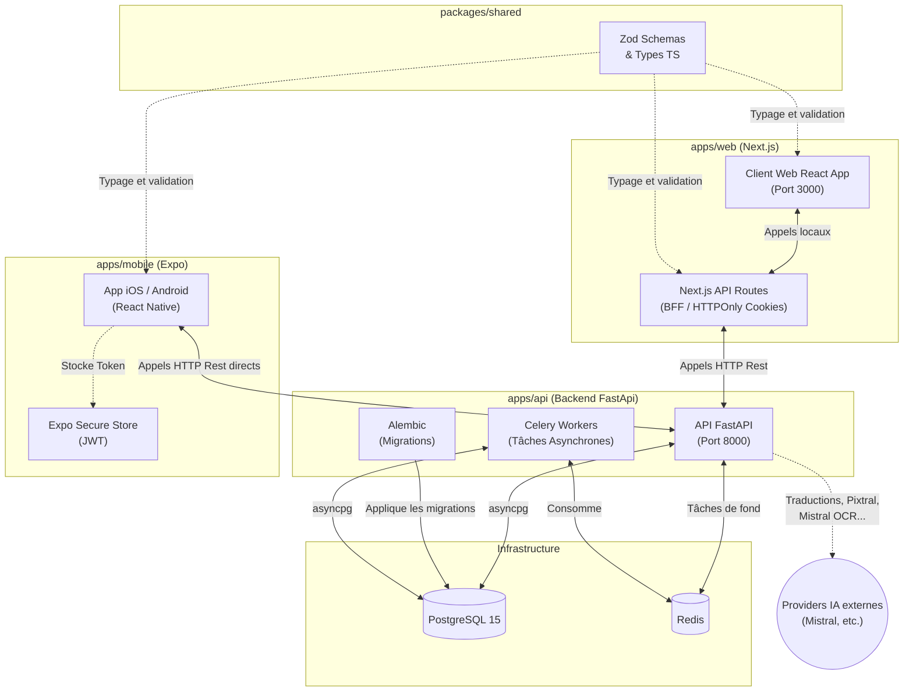

# Diagnostic & Architecture de Momentarise

## 1. Diagnostic des branchements
L'architecture globale du projet est **très propre et bien structurée** sous forme de monorepo (via NPM Workspaces). Voici l'analyse des "branchements" :

- **Backend API (`apps/api`)** : Isolé en Python (FastAPI + PostgreSQL + Celery/Redis). Cela permet d'avoir un backend orienté data/IA très performant et asynchrone, capable d'évoluer indépendamment des interfaces.
- **Partage de code (`packages/shared`)** : Le package `@momentarise/shared` est importé avec succès par `web` et `mobile`. C'est une excellente pratique : il centralise les types TypeScript et les schémas Zod, garantissant qu'en cas de changement du modèle de données, les 2 frontends seront prévenus d'erreurs de type au moment de la compilation.
- **Web (`apps/web`)** : Utilise le framework Next.js. Plutôt que de taper l'API en direct depuis le navigateur client, le Web utilise le pattern **BFF** (Backend-For-Frontend) avec Next.js. Ainsi, l'authentification peut être gérée de manière ultra-sécurisée via des cookies `HTTPOnly`.
- **Mobile (`apps/mobile`)** : React Native avec Expo et NativeWind. Communique de manière directe avec l'API exposée par FastAPI (`EXPO_PUBLIC_API_URL`). Le token d'auth est ici géré par le keychain de l'appareil (`expo-secure-store`).
- **Base de données** : PostgreSQL avec un outillage de pointe (`Alembic` pour les migrations, `asyncpg` pour la performance).

**Conclusion** : ✔️ *Tout est parfaitement branché.* La séparation Client lourd (Mobile) / BFF (Web) / API (Data/Logic) avec un socle de typage partagé (`shared`) est l'état de l'art actuel.

## 2. Vue d'ensemble (Diagramme Mermaid)

